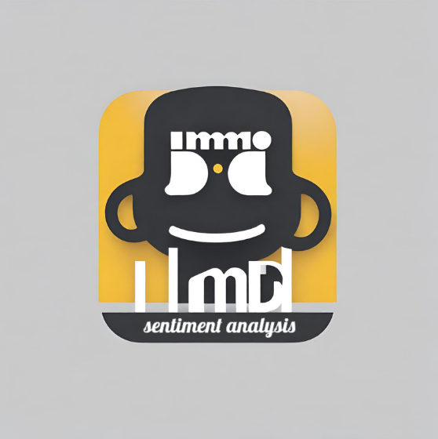

# IMDB Sentiment Analysis Project



## Table of Contents
- [Introduction](#introduction)
- [Features](#features)
- [Models](#models)
- [Getting Started](#getting-started)
- [Usage](#usage)
- [Data](#data)
- [Results](#results)
- [Contributors](#contributors)
- [License](#license)

## Introduction

Welcome to the IMDB Sentiment Analysis Project! This project is designed to perform sentiment analysis on film reviews, helping you determine the overall sentiment (positive, neutral, or negative) of a given review. Whether you are a film enthusiast, a data scientist, or a machine learning practitioner, this project offers an insightful and educational journey into natural language processing.

## Features

- **Sentiment Analysis**: Analyze film reviews and classify them as positive, neutral, or negative.
- **Web Interface**: Use the easy-to-use web interface to input your own text and get sentiment analysis results.
- **Pretrained Model**: The project includes a pretrained model, but you can also train your own with custom data.

## Models

The pre-trained models for this project are stored in the `models` folder. You can download them using the following links:

- [Word2Vec model](https://drive.google.com/uc?id=1c0cmPI2MY-qHW6v6-O8Lg1cJ1c_7FyxH&export=download)
- [Keras model](https://drive.google.com/uc?id=1YqW4gmslQxV50I4ByrF5zpYPvtJqYSpm&export=download)

However, you can also train your own model using custom data. Details on how to train your model are available in the documentation.


## Getting Started

Follow these instructions to get the project up and running on your local machine.

1. **Clone the repository**:

   ```bash
   git clone https://github.com/company-oriented-project-group/imdb_sentiment_analysis.git
   cd imdb_sentiment_analysis
   ```

2. **Install Dependencies**:

   ```bash
   pip install -r requirements.txt
   ```
   
3. **Run the Application**:

   ```bash
   python app.py
   ```

4. **Access the Web Interface**:

Open your web browser and navigate to http://localhost:8050 to start using the application

## Usage

The application provides some interesting statistics based on a subset of 500 film reviews obtained from IMDb. Additionally, it offers a user-friendly and intuitive interface for analyzing film reviews. To analyze a text, simply input it into the provided text box and click the "Analyze" button. The system will then generate the sentiment analysis result.

## Data

The project uses a labeled dataset of film reviews for training and testing the model.

## Results

Our model has achieved an accuracy of over 80% on the test dataset. For more detailed evaluation metrics, refer to the documentation.

## Contributors

- [**Aliki Kapasakalidi**](https://github.com/AlikiKap): Sentiment Analysis, Data Visualization, Sentiment Analysis Model.
- [**Yingyu Mattila**](https://github.com/C520S):Data Collection, Data Cleaning, Data Storage, Text Preprocessing, 
Report, Project Related Paperwork.
- [**Thuc Nguyen**](https://github.com/thuc-nguyen-oamk): Sentiment Analysis, Data Visualization, Sentiment Analysis Model

## License
This project is licensed under the MIT License - see the LICENSE file for details. Feel free to use and modify this project for your needs.

